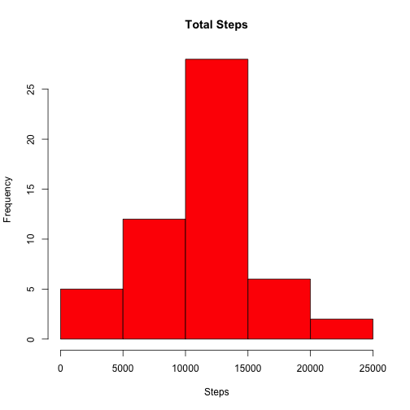
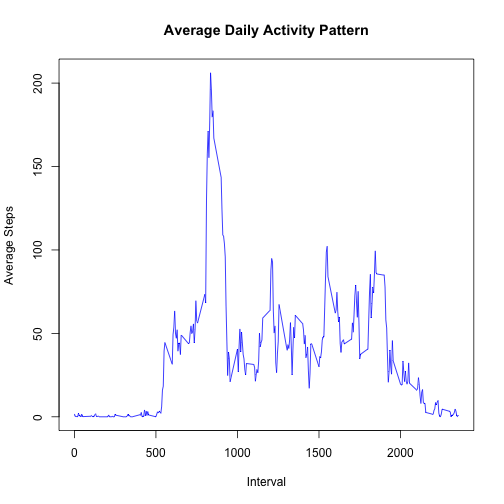
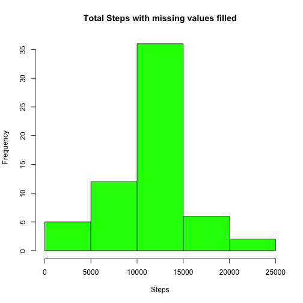
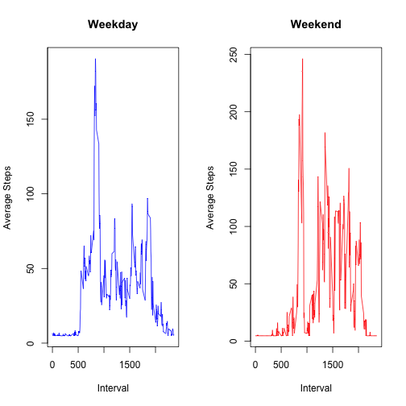

Title: "PA1_template.Rmd" - RepData_PeerAssessment1
author: "hb"
date: "September 14, 2015"
output: html_document

# Introduction
This is an assignment 1 for Reproducible Research Course

#### Loading and preprocessing the data


```r
fileUrl1 = "https://d396qusza40orc.cloudfront.net/repdata%2Fdata%2Factivity.zip"
download.file(fileUrl1,destfile="Factivity.zip",method="curl")
unzip("Factivity.zip", files = NULL, list = FALSE, overwrite = TRUE,
      junkpaths = FALSE, exdir = getwd() , unzip = "internal",
      setTimes = FALSE)
# Load the raw activity data into  DFactivity data frame
DFactivity <- read.csv("activity.csv")
```

## 1. What is mean total number of steps taken per day?

The total number of days are calcuated ignoring missing values (NAs)


```r
# Remove NA records
DFactivity_withNoNA <- na.omit(DFactivity)

mytot <- sqldf("select date, 
                       sum(steps) Totsteps, 
                       avg(steps) Mean, 
                       median(steps) Median 
               from DFactivity_withNoNA 
               group by date ")
```

### 1-1 Calculate the total number of steps taken per day

The total steps, Average of Total and Median of Total is calculated in the above step. The following are total steps per day:


```r
#mytot [,c(date,Totsteps)]
mytot[, c(1,2)]
```

```
##          date Totsteps
## 1  2012-10-02      126
## 2  2012-10-03    11352
## 3  2012-10-04    12116
## 4  2012-10-05    13294
## 5  2012-10-06    15420
## 6  2012-10-07    11015
## 7  2012-10-09    12811
## 8  2012-10-10     9900
## 9  2012-10-11    10304
## 10 2012-10-12    17382
## 11 2012-10-13    12426
## 12 2012-10-14    15098
## 13 2012-10-15    10139
## 14 2012-10-16    15084
## 15 2012-10-17    13452
## 16 2012-10-18    10056
## 17 2012-10-19    11829
## 18 2012-10-20    10395
## 19 2012-10-21     8821
## 20 2012-10-22    13460
## 21 2012-10-23     8918
## 22 2012-10-24     8355
## 23 2012-10-25     2492
## 24 2012-10-26     6778
## 25 2012-10-27    10119
## 26 2012-10-28    11458
## 27 2012-10-29     5018
## 28 2012-10-30     9819
## 29 2012-10-31    15414
## 30 2012-11-02    10600
## 31 2012-11-03    10571
## 32 2012-11-05    10439
## 33 2012-11-06     8334
## 34 2012-11-07    12883
## 35 2012-11-08     3219
## 36 2012-11-11    12608
## 37 2012-11-12    10765
## 38 2012-11-13     7336
## 39 2012-11-15       41
## 40 2012-11-16     5441
## 41 2012-11-17    14339
## 42 2012-11-18    15110
## 43 2012-11-19     8841
## 44 2012-11-20     4472
## 45 2012-11-21    12787
## 46 2012-11-22    20427
## 47 2012-11-23    21194
## 48 2012-11-24    14478
## 49 2012-11-25    11834
## 50 2012-11-26    11162
## 51 2012-11-27    13646
## 52 2012-11-28    10183
## 53 2012-11-29     7047
```
### 1-2 If you do not understand the difference between a histogram and a barplot, research the difference between them. Make a histogram of the total number of steps taken each day

The Histogram of Total number steps taken each day is below:

```r
par (mfrow = c(1,1))
hist(mytot$Totsteps , main = "Total Steps", xlab = "Steps", col = "Red")
```

 

```r
#hist(mytot$Totsteps,freq=TRUE)
```

### 1-3 Calculate and report the mean and median of the total number of steps taken per day

The mean and median of total number of steps taken each day is below:


```r
mytot[, c(1,3,4)]
```

```
##          date       Mean Median
## 1  2012-10-02  0.4375000      0
## 2  2012-10-03 39.4166667      0
## 3  2012-10-04 42.0694444      0
## 4  2012-10-05 46.1597222      0
## 5  2012-10-06 53.5416667      0
## 6  2012-10-07 38.2465278      0
## 7  2012-10-09 44.4826389      0
## 8  2012-10-10 34.3750000      0
## 9  2012-10-11 35.7777778      0
## 10 2012-10-12 60.3541667      0
## 11 2012-10-13 43.1458333      0
## 12 2012-10-14 52.4236111      0
## 13 2012-10-15 35.2048611      0
## 14 2012-10-16 52.3750000      0
## 15 2012-10-17 46.7083333      0
## 16 2012-10-18 34.9166667      0
## 17 2012-10-19 41.0729167      0
## 18 2012-10-20 36.0937500      0
## 19 2012-10-21 30.6284722      0
## 20 2012-10-22 46.7361111      0
## 21 2012-10-23 30.9652778      0
## 22 2012-10-24 29.0104167      0
## 23 2012-10-25  8.6527778      0
## 24 2012-10-26 23.5347222      0
## 25 2012-10-27 35.1354167      0
## 26 2012-10-28 39.7847222      0
## 27 2012-10-29 17.4236111      0
## 28 2012-10-30 34.0937500      0
## 29 2012-10-31 53.5208333      0
## 30 2012-11-02 36.8055556      0
## 31 2012-11-03 36.7048611      0
## 32 2012-11-05 36.2465278      0
## 33 2012-11-06 28.9375000      0
## 34 2012-11-07 44.7326389      0
## 35 2012-11-08 11.1770833      0
## 36 2012-11-11 43.7777778      0
## 37 2012-11-12 37.3784722      0
## 38 2012-11-13 25.4722222      0
## 39 2012-11-15  0.1423611      0
## 40 2012-11-16 18.8923611      0
## 41 2012-11-17 49.7881944      0
## 42 2012-11-18 52.4652778      0
## 43 2012-11-19 30.6979167      0
## 44 2012-11-20 15.5277778      0
## 45 2012-11-21 44.3993056      0
## 46 2012-11-22 70.9270833      0
## 47 2012-11-23 73.5902778      0
## 48 2012-11-24 50.2708333      0
## 49 2012-11-25 41.0902778      0
## 50 2012-11-26 38.7569444      0
## 51 2012-11-27 47.3819444      0
## 52 2012-11-28 35.3576389      0
## 53 2012-11-29 24.4687500      0
```

## 2 What is the average daily activity pattern?

```r
myinterval <- sqldf("select interval, 
                       sum(steps) Totsteps, 
                       avg(steps) Avesteps
                    from DFactivity_withNoNA 
                    group by interval ")
```

### 2-1 Make a time series plot (i.e. type = "l") of the 5-minute interval (x-axis) and the average number of steps taken, averaged across all days (y-axis)

Below is the time series plot of interval and average steps taken per day:


```r
plot(myinterval$interval, myinterval$Avesteps, type = "l" ,main = "Average Daily Activity Pattern", xlab = "Interval", ylab = "Average Steps", col = "Blue")
```

 

### 2-2 Which 5-minute interval, on average across all the days in the dataset, contains the maximum number of steps?

Below is the 5-minute interval that contains highest steps:

```r
subset(myinterval, myinterval$Avesteps == max(myinterval$Avesteps)) ### Get max Average from the DF
```

```
##     interval Totsteps Avesteps
## 104      835    10927 206.1698
```

## 3 Imputing missing values

### 3-1 Calculate and report the total number of missing values in the dataset (i.e. the total number of rows with NAs)

Calculating the number of missing values in the data frame DFactivity (The raw data)


```r
missing <- sum(is.na(DFactivity))
total <-nrow(DFactivity)
per_missing <- (missing/total) *100
per_missing
```

```
## [1] 13.11475
```

```r
missing
```

```
## [1] 2304
```

Per above calculation, the data has 2304 missing values (NAs) which is aroun 13%

### 3-2 Devise a strategy for filling in all of the missing values in the dataset.

My strategy is to replace the missing values with Average of average mean of steps calculated from data frame mytot that was created in Step/Question 1

```r
avgOfMean <- mean(mytot$Mean) # Calculate the average of average steps per day
avgOfMean  ## Display the fill in for missing vlaues
```

```
## [1] 37.3826
```

```r
DFactivity_nomissing <- DFactivity # copy the original raw data into a temp data frame

### Fill in the NA with avgOfMean calcualted in the prior step
DFactivity_nomissing$steps <- ifelse(is.na(DFactivity_nomissing$steps), avgOfMean, DFactivity_nomissing$steps ) 
```

### 3-3 Create a new dataset that is equal to the original dataset but with the missing data filled in.


```r
mytot_nomissing <- sqldf("select date, 
                       sum(steps) Totsteps, 
                       avg(steps) Average, 
                       median(steps) Median 
               from DFactivity_nomissing
               group by date ")  # New data set with misssing values filled group by date
```

### 3-4 Make a histogram of the total number of steps taken each day and Calculate and report the mean and median total number of steps taken per day. 


```r
### plot total steps by date with missing values filled in
par (mfrow = c(1,1))
hist(mytot_nomissing$Totstep , main = "Total Steps with missing values filled", xlab = "Steps", col = "Green")
```

 

Here is the mean, median, and total steps per day after filling in the missing values:

```r
mytot_nomissing # Display mean, median and total steps after filling in the missing values
```

```
##          date Totsteps    Average  Median
## 1  2012-10-01 10766.19 37.3825996 37.3826
## 2  2012-10-02   126.00  0.4375000  0.0000
## 3  2012-10-03 11352.00 39.4166667  0.0000
## 4  2012-10-04 12116.00 42.0694444  0.0000
## 5  2012-10-05 13294.00 46.1597222  0.0000
## 6  2012-10-06 15420.00 53.5416667  0.0000
## 7  2012-10-07 11015.00 38.2465278  0.0000
## 8  2012-10-08 10766.19 37.3825996 37.3826
## 9  2012-10-09 12811.00 44.4826389  0.0000
## 10 2012-10-10  9900.00 34.3750000  0.0000
## 11 2012-10-11 10304.00 35.7777778  0.0000
## 12 2012-10-12 17382.00 60.3541667  0.0000
## 13 2012-10-13 12426.00 43.1458333  0.0000
## 14 2012-10-14 15098.00 52.4236111  0.0000
## 15 2012-10-15 10139.00 35.2048611  0.0000
## 16 2012-10-16 15084.00 52.3750000  0.0000
## 17 2012-10-17 13452.00 46.7083333  0.0000
## 18 2012-10-18 10056.00 34.9166667  0.0000
## 19 2012-10-19 11829.00 41.0729167  0.0000
## 20 2012-10-20 10395.00 36.0937500  0.0000
## 21 2012-10-21  8821.00 30.6284722  0.0000
## 22 2012-10-22 13460.00 46.7361111  0.0000
## 23 2012-10-23  8918.00 30.9652778  0.0000
## 24 2012-10-24  8355.00 29.0104167  0.0000
## 25 2012-10-25  2492.00  8.6527778  0.0000
## 26 2012-10-26  6778.00 23.5347222  0.0000
## 27 2012-10-27 10119.00 35.1354167  0.0000
## 28 2012-10-28 11458.00 39.7847222  0.0000
## 29 2012-10-29  5018.00 17.4236111  0.0000
## 30 2012-10-30  9819.00 34.0937500  0.0000
## 31 2012-10-31 15414.00 53.5208333  0.0000
## 32 2012-11-01 10766.19 37.3825996 37.3826
## 33 2012-11-02 10600.00 36.8055556  0.0000
## 34 2012-11-03 10571.00 36.7048611  0.0000
## 35 2012-11-04 10766.19 37.3825996 37.3826
## 36 2012-11-05 10439.00 36.2465278  0.0000
## 37 2012-11-06  8334.00 28.9375000  0.0000
## 38 2012-11-07 12883.00 44.7326389  0.0000
## 39 2012-11-08  3219.00 11.1770833  0.0000
## 40 2012-11-09 10766.19 37.3825996 37.3826
## 41 2012-11-10 10766.19 37.3825996 37.3826
## 42 2012-11-11 12608.00 43.7777778  0.0000
## 43 2012-11-12 10765.00 37.3784722  0.0000
## 44 2012-11-13  7336.00 25.4722222  0.0000
## 45 2012-11-14 10766.19 37.3825996 37.3826
## 46 2012-11-15    41.00  0.1423611  0.0000
## 47 2012-11-16  5441.00 18.8923611  0.0000
## 48 2012-11-17 14339.00 49.7881944  0.0000
## 49 2012-11-18 15110.00 52.4652778  0.0000
## 50 2012-11-19  8841.00 30.6979167  0.0000
## 51 2012-11-20  4472.00 15.5277778  0.0000
## 52 2012-11-21 12787.00 44.3993056  0.0000
## 53 2012-11-22 20427.00 70.9270833  0.0000
## 54 2012-11-23 21194.00 73.5902778  0.0000
## 55 2012-11-24 14478.00 50.2708333  0.0000
## 56 2012-11-25 11834.00 41.0902778  0.0000
## 57 2012-11-26 11162.00 38.7569444  0.0000
## 58 2012-11-27 13646.00 47.3819444  0.0000
## 59 2012-11-28 10183.00 35.3576389  0.0000
## 60 2012-11-29  7047.00 24.4687500  0.0000
## 61 2012-11-30 10766.19 37.3825996 37.3826
```
### 3-5 Do these values differ from the estimates from the first part of the assignment? 
Yes
###What is the impact of imputing missing data on the estimates of the total daily number of steps?

These values differ from the estimates from the first part of the assignment. With missing values filled in, the average of total daily number of steps increasd for the date that had missing values (for eg: 2012-10-02). However, it had no impact on other dates which do not have missing values. However, the historgram above (in green) looks little more normalized than before.

## 4 Are there differences in activity patterns between weekdays and weekends?

### 4-1 Create a new factor variable in the dataset with two levels – “weekday” and “weekend” indicating whether a given date is a weekday or weekend day.


```r
### Create a new variable "day"" in data frame DFactivity_nomissing with weekday or weekend based on the date

DFactivity_nomissing$day <- ifelse(as.POSIXlt(DFactivity_nomissing$date)$wday >5,"weekend", "weekday" )

### Create a inteval summary with weekday data
myinterval_weekday <- sqldf("select interval, 
                       sum(steps) Totsteps, 
                       avg(steps) Avesteps
                    from DFactivity_nomissing
                    where day = 'weekday'
                    group by interval ")

### Create a inteval summary with weekend data
myinterval_weekend <- sqldf("select interval, 
                       sum(steps) Totsteps, 
                       avg(steps) Avesteps
                    from DFactivity_nomissing
                    where day = 'weekend'
                    group by interval ")
```
### 4-2 Make a panel plot containing a time series plot (i.e. type = "l") of the 5-minute interval (x-axis) and the average number of steps taken, averaged across all weekday days or weekend days (y-axis). 
 

